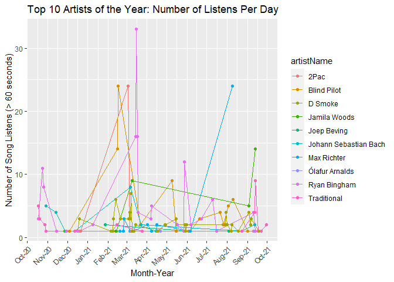

Cody’s Spotify Stats 2021
================

# Confessions of Amy

  - My spotify song statistics from the last year

### Most Frequently Played Songs

``` r
## in SQL
dbGetQuery(con, "SELECT artistName, trackName, COUNT(trackName) as number
           FROM StreamingHistory
           GROUP BY trackName
           ORDER BY number DESC
           LIMIT 10")
```

    ## # A tibble: 10 x 3
    ## # Groups:   artistName, trackName [10]
    ##    artistName        trackName                                 n
    ##    <chr>             <chr>                                 <int>
    ##  1 Tamara Bubble     "Self Motivated"                         24
    ##  2 Patrick Doyle     "Non Nobis, Domine (From \"Henry V')"    17
    ##  3 Broken Bells      "The High Road"                          15
    ##  4 D Smoke           "Gaspar Yanga"                           12
    ##  5 JR JR             "Gone"                                   12
    ##  6 Ryan Bingham      "Sunrise"                                10
    ##  7 The Royal Concept "D-D-Dance"                              10
    ##  8 D Smoke           "It's Ok"                                 9
    ##  9 Matt and Kim      "Daylight"                                9
    ## 10 Passion Pit       "Take a Walk"                             9

### Most Frequently Played Artists

``` r
## in SQL
dbGetQuery(con, 'SELECT artistName, COUNT(artistName) as count
            FROM StreamingHistory
            GROUP BY artistName 
            ORDER BY count DESC
            LIMIT 10')
```

    ## # A tibble: 10 x 2
    ## # Groups:   artistName [10]
    ##    artistName                n
    ##    <chr>                 <int>
    ##  1 Ryan Bingham            155
    ##  2 Max Richter             118
    ##  3 D Smoke                 104
    ##  4 Blind Pilot              82
    ##  5 2Pac                     36
    ##  6 Traditional              35
    ##  7 Jamila Woods             32
    ##  8 Joep Beving              32
    ##  9 Ólafur Arnalds           32
    ## 10 Johann Sebastian Bach    29

### Most Songs Played in One Day

  - This would include skipping a song after, say, 3-10 seconds
      - Could filter out results that are less than 30 seconds to 1
        minute

<!-- end list -->

    ## # A tibble: 10 x 2
    ## # Groups:   date [10]
    ##    date           n
    ##    <chr>      <int>
    ##  1 2020-11-07   134
    ##  2 2021-02-21   133
    ##  3 2021-09-25   119
    ##  4 2021-03-07   105
    ##  5 2021-08-09   102
    ##  6 2021-02-07   100
    ##  7 2021-05-07    96
    ##  8 2021-02-15    95
    ##  9 2021-09-12    90
    ## 10 2021-09-13    84

``` r
## this is SQLITE syntax, other SQL might use "LEFT(endTime, 10)"
# temporarily create a column named date, use that to group by...COUNT doesn't work on aliases I guess
dbGetQuery(con, 'SELECT substr(endTime, 1, 10) AS date, COUNT(endTime) AS count, SUM(msPlayed) as songTime
                 FROM StreamingHistory
                 GROUP BY date
                 ORDER BY count DESC
                 LIMIT 10')
```

### Of top 10 listened to artists, over what time period did I listen to them the most?

  - Counts of that artist per endDate through time
  - This is much nicer to view as an interactive ggplotly chart (but
    GitHub doesn’t quite render it)

<!-- end list -->

``` r
# stream_data %>% mutate(date = str_sub(endTime, 1, 10)) %>% 
#     # this is a shortcut subquery, technically
#     filter(artistName %in% res_freq_artists$artistName) %>% 
#     # 
#     group_by(date, artistName) %>% 
#     count %>% 
#     arrange(desc(n))

plotly::ggplotly(
    stream_data %>% mutate(date = str_sub(endTime, 1, 10)) %>% 
    # this is a shortcut subquery, technically
    # filter out song listens that are less than 1 minute in length
    filter(artistName %in% res_freq_artists$artistName & msPlayed > (60 * 1000)) %>% 
    group_by(date, artistName) %>% 
    count %>% 
    ggplot(aes(x = as.Date(date), y = n, group = artistName, color = artistName)) +
    geom_line() + 
    geom_point() + 
    theme(axis.text.x = element_text(angle = 45, hjust = 1)) + 
    scale_x_date(date_breaks = "months" , date_labels = "%b-%y") +
    xlab('Month-Year') + 
    ylab('Number of Song Listens (> 60 seconds)') + 
    ggtitle('Top 10 Artists of the Year: Number of Listens Per Day')
)
```

    ## Warning: `group_by_()` was deprecated in dplyr 0.7.0.
    ## Please use `group_by()` instead.
    ## See vignette('programming') for more help

<!-- -->

``` r
# 
# ## subquery example, joining IS a form of filtering by another table
# subquery <- stream_data %>% 
#     mutate(date = str_sub(endTime, 1, 10)) %>% 
#     # this is a shortcut subquery, technically
#     # filter out song listens that are less than 1 minute in length
#     right_join(., stream_data %>%
#         filter(msPlayed > (60 * 1000)) %>% 
#         group_by(artistName) %>% 
#         count %>% 
#         arrange(desc(n)) %>% 
#             select(artistName) %>% 
#         head(10))
```

### Seasonal Song Repetition

``` r
# Kowloon, MadeinTYO, Modern Baseball, No vacation, Sea Power

    stream_data %>% mutate(date = str_sub(endTime, 1, 10)) %>% 
    # this is a shortcut subquery, technically
    # filter out song listens that are less than 1 minute in length
    filter(artistName %in% res_freq_artists$artistName & msPlayed > (60 * 1000)) %>% 
    group_by(date, artistName) %>% 
    count %>% 
    ggplot(aes(x = as.Date(date), y = n, group = artistName, color = artistName)) +
    geom_line() + 
    geom_point() + 
    theme(axis.text.x = element_text(angle = 45, hjust = 1)) + 
    scale_x_date(date_breaks = "months" , date_labels = "%b-%y") +
    xlab('Month-Year') + 
    ylab('Number of Song Listens (> 60 seconds)') + 
    ggtitle('Top 10 Artists of the Year: Number of Listens Per Day')
```

<!-- -->
