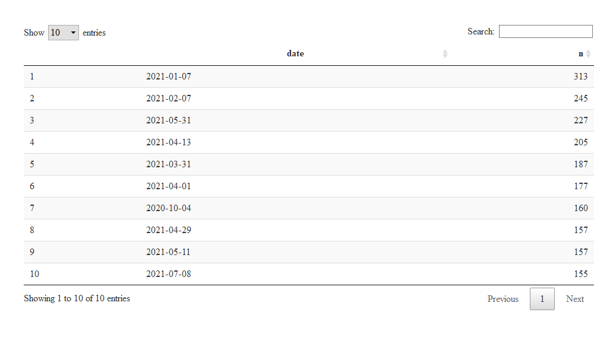

Cody’s Spotify Stats 2021
================

# Confessions of a Song Repeater

  - My spotify song statistics from the last year

### Most Frequently Played Songs

``` r
## in SQL
dbGetQuery(con, "SELECT artistName, trackName, COUNT(trackName) as number
           FROM StreamingHistory
           GROUP BY trackName
           ORDER BY number DESC
           LIMIT 10")
```

    ## # A tibble: 10 x 3
    ## # Groups:   artistName, trackName [10]
    ##    artistName   trackName                   n
    ##    <chr>        <chr>                   <int>
    ##  1 Sea Power    Want To Be Free            92
    ##  2 Sea Power    Red Rock Riviera           81
    ##  3 TV Girl      Lovers Rock                80
    ##  4 Sea Power    The South Sound            79
    ##  5 No Vacation  Yam Yam                    78
    ##  6 No Vacation  Days                       77
    ##  7 No Vacation  Estrangers                 75
    ##  8 Phantogram   Fall In Love               75
    ##  9 Dayglow      Can I Call You Tonight?    74
    ## 10 Current Joys Neon Hell - Live           70

### Most Frequently Played Artists

``` r
## in SQL
dbGetQuery(con, 'SELECT artistName, COUNT(artistName) as count
            FROM StreamingHistory
            GROUP BY artistName 
            ORDER BY count DESC
            LIMIT 10')
```

    ## # A tibble: 10 x 2
    ## # Groups:   artistName [10]
    ##    artistName          n
    ##    <chr>           <int>
    ##  1 No Vacation      1099
    ##  2 Current Joys      942
    ##  3 Modern Baseball   674
    ##  4 fingerspit        657
    ##  5 MadeinTYO         608
    ##  6 Dayglow           591
    ##  7 Sea Power         585
    ##  8 Delta Sleep       478
    ##  9 Wild Nothing      348
    ## 10 Kowloon           327

### Most Songs Played in One Day

  - This would include skipping a song after, say, 3-10 seconds
      - Could filter out results that are less than 30 seconds to 1
        minute

<!-- end list -->

    ## # A tibble: 10 x 2
    ## # Groups:   date [10]
    ##    date           n
    ##    <chr>      <int>
    ##  1 2021-01-07   313
    ##  2 2021-02-07   245
    ##  3 2021-05-31   227
    ##  4 2021-04-13   205
    ##  5 2021-03-31   187
    ##  6 2021-04-01   177
    ##  7 2020-10-04   160
    ##  8 2021-04-29   157
    ##  9 2021-05-11   157
    ## 10 2021-07-08   155

``` r
## this is SQLITE syntax, other SQL might use "LEFT(endTime, 10)"
# temporarily create a column named date, use that to group by...COUNT doesn't work on aliases I guess
dbGetQuery(con, 'SELECT substr(endTime, 1, 10) AS date, COUNT(endTime) AS count, SUM(msPlayed) as songTime
                 FROM StreamingHistory
                 GROUP BY date
                 ORDER BY count DESC
                 LIMIT 10')
```

### Of top 10 listened to artists, over what time period did I listen to them the most?

  - Counts of that artist per endDate through time

<!-- end list -->

``` r
# stream_data %>% mutate(date = str_sub(endTime, 1, 10)) %>% 
#     # this is a shortcut subquery, technically
#     filter(artistName %in% res_freq_artists$artistName) %>% 
#     # 
#     group_by(date, artistName) %>% 
#     count %>% 
#     arrange(desc(n))

#ggplotly(
    stream_data %>% mutate(date = str_sub(endTime, 1, 10)) %>% 
    # this is a shortcut subquery, technically
    # filter out song listens that are less than 1 minute in length
    filter(artistName %in% res_freq_artists$artistName & msPlayed > (60 * 1000)) %>% 
    group_by(date, artistName) %>% 
    count %>% 
    ggplot(aes(x = as.Date(date), y = n, group = artistName, color = artistName)) +
    geom_line() + 
    geom_point() + 
    theme(axis.text.x = element_text(angle = 45, hjust = 1)) + 
    scale_x_date(date_breaks = "months" , date_labels = "%b-%y") +
    xlab('Month-Year') + 
    ylab('Number of Song Listens (> 60 seconds)') + 
    ggtitle('Top 10 Artists of the Year: Number of Listens Per Day')
```

<!-- -->

``` r
#)
# 
# ## subquery example, joining IS a form of filtering by another table
# subquery <- stream_data %>% 
#     mutate(date = str_sub(endTime, 1, 10)) %>% 
#     # this is a shortcut subquery, technically
#     # filter out song listens that are less than 1 minute in length
#     right_join(., stream_data %>%
#         filter(msPlayed > (60 * 1000)) %>% 
#         group_by(artistName) %>% 
#         count %>% 
#         arrange(desc(n)) %>% 
#             select(artistName) %>% 
#         head(10))
```

##### compare most played artists this year to Summer Rewind playlists of 2019 and 2020

##### artist diversity

##### song diversity

\`\`\`
