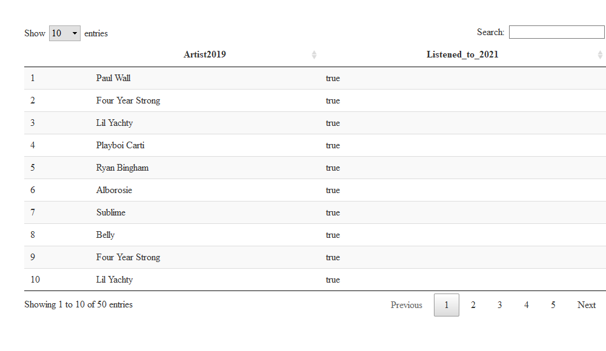

Cody’s Spotify Listening Habits - 2021
================

# Confessions of a Song Repeater

-   A simple demonstration of how to analyze spotify streaming data,
    using my statistics from the last year.
-   I have a pretty broad taste in music, but will often repeatedly
    listen to a new song or group when there’s a particular sound that
    is striking.

## Transforming and Structuring Data

-   The following function binds the streaming history files into one
    data.frame/table
    -   The number of streaming files you have can vary, and depends on
        how many streams you have listened to in the last year.
    -   A “stream” can be anything from listening to a song for 3
        seconds (and then skipping it) to pressing the “play” button on
        an entire album

``` r
##### convert flat JSON to CSV #####
fx_stackJSON <- function(file_list){
    
    out <- lapply(file_list, FUN = function(x){
        
        mid = fromJSON(x[[1]])
        
    }) %>% bind_rows(.)
    
    return(out)
    
}

# jsonlite::parse_json(<input_data>)
stream_data <- fx_stackJSON(stream_files)

## each row in this data frame has a list nested in the column "items"
playlist_data <- fromJSON(playlist_files, flatten=TRUE)

# names(stream_data)
# names(playlist_data)
```

-   Below we use an anonymous function inside of `lapply()` to parse the
    playlist files, which are nested within one particular field as a
    list, and convert it into a nice flat data.frame/table

``` r
## grab just the playlist names
playlist_names <- playlist_data$playlists$name

## extract the nested list as a data.frame, assign the playlist name
combined_playlists <- lapply(seq(1, length(playlist_data$playlists$items)), FUN = function(playlist_index){
    
    ## for each data.frame, add a column that matches the index of playlist_names
    playlist <- playlist_data$playlists$items[[playlist_index]]
    
    ## append the playlist name to the data.frame
    playlist$playlist_name <- playlist_names[playlist_index]
    
    ## cleanup column names
    playlist <- playlist %>% rename(trackName = track.trackName, 
                                    artistName = track.artistName,
                                    albumName = track.albumName, 
                                    trackUri=track.trackUri)
        
    return(playlist)
    
    ## return a single data.frame
}) %>% bind_rows(.)

##### load data to an in memory database #####
dbWriteTable(con, "StreamingHistory", stream_data)
dbWriteTable(con, "Playlists", combined_playlists)
```

### Most Frequently Played Songs

``` r
## in SQL
dbGetQuery(con, "SELECT artistName, trackName, COUNT(trackName) as number
           FROM StreamingHistory
           GROUP BY trackName
           ORDER BY number DESC
           LIMIT 10")
```

<!-- -->

### Most Frequently Played Artists

``` r
## in SQL
dbGetQuery(con, 'SELECT artistName, COUNT(artistName) as count
            FROM StreamingHistory
            GROUP BY artistName 
            ORDER BY count DESC
            LIMIT 10')
```

<!-- -->

### Most Songs Played in One Day

-   This would include skipping a song after, say, 3-10 seconds
    -   Could filter out results that are less than 30 seconds to 1
        minute

<!-- -->

``` r
## this is SQLITE syntax, other SQL might use "LEFT(endTime, 10)"
# temporarily create a column named date, use that to group by...COUNT doesn't work on aliases I guess
dbGetQuery(con, 'SELECT substr(endTime, 1, 10) AS date, COUNT(endTime) AS count, SUM(msPlayed) as songTime
                 FROM StreamingHistory
                 GROUP BY date
                 ORDER BY count DESC
                 LIMIT 10')
```

### Of top 10 listened to artists, over what time period did I listen to them the most?

-   Counts of that artist per endDate through time
-   This is much nicer to view as an interactive ggplotly chart (but
    GitHub doesn’t quite render it)
-   `NOTE` Opening this file in the `.html` format will display the
    following chart interactively. For instance, you can double-click a
    band name in the legend to spotlight those particular data points.

``` r
    stream_data %>% mutate(date = str_sub(endTime, 1, 10)) %>% 
    # this is a shortcut subquery, technically
    # filter out song listens that are less than 1 minute in length
    filter(artistName %in% res_freq_artists$artistName & msPlayed > (60 * 1000)) %>% 
    group_by(date, artistName) %>% 
    count %>% 
    ggplot(aes(x = as.Date(date), y = n, group = artistName, color = artistName)) +
    geom_line() + 
    geom_point() + 
    theme(axis.text.x = element_text(angle = 45, hjust = 1)) + 
    scale_x_date(date_breaks = "months" , date_labels = "%b-%y") +
    xlab('Month-Year') + 
    ylab('Number of Song Listens (> 60 seconds)') + 
    ggtitle('Top 10 Artists of the Year: Number of Listens Per Day')
```

<!-- -->

# Changes in Listening Behavior, Summer 2019 vs. 2021

-   Spotify only provides listening data for the past year, but if you
    have ever saved your “Summer Rewind 20XX” or other auto-generated
    playlists then you may use those to see if your tastes have changed
    through time.
-   My “Summer Rewind 2019” playlist in particular is useful to analyze
    from a song repeater perspective
-   Let’s look at this in two ways:
    -   Which artists in 2019 am I still listening to (or not)?
    -   Of the top 50 artists I listened to in 2021, did I listen to
        them in 2021?

``` r
## grab the Summer 2019 playlist
previous_repeat_plays <- combined_playlists %>% filter(playlist_name == 'Summer Rewind 2019')

## grab total listens per artist THIS year, then join to compare
current_repeat_plays <- stream_data %>% 
    group_by(artistName, trackName) %>% 
    count %>% 
    arrange(desc(n)) 
```

-   Which artists in 2019 am I still listening to (or not)?

``` r
datatable(data.frame(Artist2019 = previous_repeat_plays$artistName,
                     Listened_to_2021 = previous_repeat_plays$artistName %in% current_repeat_plays$artistName))
```

<!-- -->

-   Apparently I’m still listening to all 50 artists I enjoyed Summer
    of 2019.
-   Are any of the 2019 artists *still* in my Top 50 for 2021 though?

``` r
# run an inner join
current_repeat_plays %>% head(50) %>% inner_join(., previous_repeat_plays, by = 'artistName') %>% datatable()
```

<!-- -->

-   Only one frequently played artist in 2019 is still in my top 50 this
    year.
